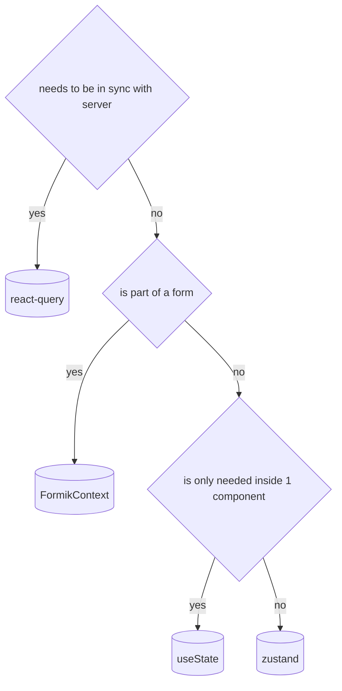

## Get started with development

### Setup

#### 1. Download the Repo

Navigate a console to the location of the files and install the dependencies with `npm install`.
Create a mysql database called “easyreading” with user: root password: Root%$123. I suggest using the tool XAMPP, as it makes this very easy.
You can find it here: https://www.apachefriends.org/de/download.html

In terminal run: `npm start` - If everything is working, there should be no errors and your console should end with the following message:
`Init server complete`

#### 2. Get the Repo for the extension

- [Chrome](https://github.com/IISJKU/easy-reading-chrome-extension)
- [Firefox](https://github.com/IISJKU/easy-reading-firefox-extension)

By default, this extension uses the cloudendpoint easyreading-cloud.eu - we want to use loacalhost (aka the one that we just launched)
To do this, you need to change the file (which you find in the extension folder) `EasyReading/background/easy-reading.js`

- Under `getDefaultConfig` set `cloudEndpointIndex: 2`.
Normally this says `cloudEndpointIndex: 0`, which points to the production-server easyreading-cloud.eu. 
Using `cloudEndpointIndex: 2`, points us to localhost.
 - Reimport the extension.

If everything worked out, the paths should now look like: `https://localhost:8080/client/setup`, which means it is using our local easyreading install.

:::warning If the url still says “easyreading” then you have done something wrong.

### Next Steps

To make plugin development easier, go to `components/plugins/test-plugin` in this repo and change it to your liking.

## Javascript

### Comments & Documentation

2 Styles: JSDoc `/**...*/` & ordinary comments `//...` or `/*...*/`

- Use `/** JSDoc */` comments for documentation, i.e. comments a user of the code should read.
- Use `// line comments` for implementation comments, i.e. comments that only concern the implementation of the code itself.

#### JSDoc

- symbols in `/utils`-folder require `JSDoc` comments

##### recommended `JSDOC Tags`

- `@desc` / `@description`
  - should provide general description of a symbol
  - if you describe a symbol at the very top of a documentation you can omit the `@desc` tag as it gets inferred
- `@param`
  - used to document a parameter of a function
  - ⚠️ do not add the type of the parameter
  - Example usage

```ts
/**
 * @param bar argument of function
 */
function Foo(bar: string) {}
```

- `@returns`
  - used to document the return type of a function
  - ⚠️ if return type is implicity add return type to documentation
  - Example usage

```ts
/**
 * @returns {string | undefined} returns test if bar was passed as an * argument, returns undefined if not
 */
function Foo(bar?: string) {
  return bar ? "test" : undefined;
}
```

- `@see`
  - should be used when linking to external documentation
  - used in conjuction with the `@link` tag
  - Example

```ts
/**
 * @see {@link http://link.to.documentation|Documentation}
 */
function Foo(bar?: string) {
  return bar ? "test" : undefined;
}
```

- other `JSDoc` tags can be used if needed for a full list see here: <https://jsdoc.app/>

#### Comments

- comments should be meaningful & add value/context
- add comments for non-obvious implementation details
- `TODO` comments are disallowed

### Identifiers & Naming

- `kebab-case`
- `PascalCase` : SomethingComponents, StyleFiles
- `camelCase`
- ...

### Source Organization

#### Organize by Feature _(?)_

- _TODO: (provide Table)_

#### Imports & Exports

- prefer relative imports
- use import alias where applicable
- use named export except when used for lazy loading
- when using default exports disable eslint-rule with a provided reason

### Types

#### General

- prefer `type` over `interface`
- declare `types` as close to usage as possible

#### Assertion

- when asserting object types prefer using `satisfies`
- use user-defined type-guards when necessary

#### Coercion

- when asserting non-nullability (eg. `foo!.bar`) provided a comment why
- when `satisfies` does not work prefer `foo as Foo` as opposed to `<Foo>foo`

#### null, undefined & optional

- prefer `undefined` over `null`

#### unknown, any, never

- prefer `unknown` over `any`

#### Record, Map, mapped Types

### Functions

- prefer function declarations to expressions

:::tip Good

```ts function Foo()
function Foo(){
...
}
```

:::

:::warning Bad

```tsx
const foo = () => {};
```

:::

:::info Exception when providing an explicit Type

```tsx
type TypedFoo: (arg: Argument) => void

const foo : TypedFoo = (arg) => {}
```

:::

- Consider using named named arguments, especially if taking multiple arguments

```ts
//definition
type Args: {
 foo: string,
 bar: string,
 baz: string
}

function multipleArgs(args: Args){
 const {foo, bar, baz} = args;
 ...
}
//usage
multipleArgs({foo: "foo", bar: "bar", baz: "baz"})
```

### External Dependencies

:::warning
do not add an external dependency without approval from maintainer
:::

- if you introduce an external dependency to the codebase you are considered the owner, which means you are responsible for maintenance & should serve as the primary educator for the team

### Rule of Thumb for external-dependencies

- must provide value that is not achievable by writing it ourself (i.e. non-trivial, de-facto-standard, to much effort to maintain ourselfs)
- must conform to the license-whitelist
- must be actively maintained
- should not contain any known vulnerabilities

## Suggestion for future work

### Eslint Rules 

- introducing an eslint should be discussed with the team & requires communication after introduction
- when disabling eslint-rules a reason must be provided

## React

### Components

#### Component Structure

1. Imports
2. Prop Type Definition
3. Additional Variables (CONSTANTS)
4. Component
   1. Prop destruct assignment
   2. Translation hook
   3. styles hooks
   4. other hooks
   5. functions
   6. useEffect hook
   7. TSX markup

- be explicit when using Fragments

:::tip Good

```tsx
return <Fragment>...</Fragment>;
```

:::
:::warning Bad

```tsx
return <>...</>;
return <div>...</div>;
```

:::

- use prop spreading if possible

```tsx
const props = { foo: "string", bar: "string", baz: "string" };
//good
return <Component {...props} />;
//not so good
return <Component foo="string" bar="string" baz="string" />;
```

- use self-closing tags if a component doesnt take children

:::tip Good

```tsx
return <Component />;
```

:::

:::warning Bad

```tsx
return <Component></Component>;
```

:::

### Managing State

- Choosing State Solution



#### React Query

Provides State-Management for Backend/Frontend Communication

##### using queries

- only use queries inside components/hooks were the queryData is needed to prevent unnecessary rerenders

##### using mutators

- provided atleast `onSuccess` & `onError` callbacks
- descriptive mutator naming i.e. `createFoo` intead of `fooMutator`

##### accessing `queryKeys`

getters for `queryKeys` for each Query are provided by the `api` package
following the `get${queryName}QueryKey()` schema i.e:

```tsx
//query
useGetFoo();
//get associated queryKey
getGetFooQueryKey();
```

#### Zustand

Zustand is to be used when managing application-state that does not the to be persisted to the backend & needs to be avaliable in wider scope (i.e globally)

##### Structure

- declare state-actions as a seperate type i.e:

```ts
type Actions = {
 foo: (bar: Bar) => void;
 baz: () => void
}

type State = {
 prop: Prop
 actions: Actions
}

const useZustand = create<State>(...)

```

- actions should be documented using `JSDoc`

##### Usage

- actions(reducers) should not have side-effects, only expection is when dispatching an event tracking action
- export actions with a seperate hook

```ts
const useZustand = create<State>(...)
const useStateActions = useZustand((state) => state.actions)
```

###### Accessing the state

- only import props that are needed

```tsx
import { useState } from "@state";

function Component() {
  const [prop] = useZustand((state) => state.prop);

  return <Fragment>{prop}</Fragment>;
}
```

#### Local State

- combine state where possible
- state always needs to be explicilty typed

#### Forms

- use Zod
